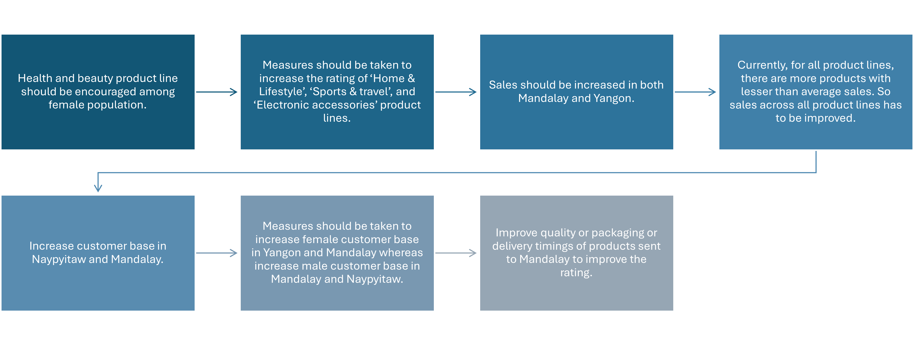

# E-commerce sales analysis

* The dataset contains sales transactions from three different branches of Amazon, respectively located in Mandalay, Yangon and Naypyitaw. The data contains 17 columns and 1000 rows.
* The major aim of this project is to gain insight into the sales data of Amazon to understand the different factors that affect sales of the different branches.
* The queries were performed on MySQL and Excel was used the visualize the query results.

## Objective
    The major aim of this project is to gain insight into the sales data of Amazon to understand the different factors that affect sales of the different branches. For this, the list of analysis conducted are:
* **Product analysis** - to understand the different product lines, the products lines performing best and the product lines that need to be improved.
* **Sales analysis** -  to answer the question of the sales trends of product. The result of this can help us measure the effectiveness of each sales strategy the business applies and what modifications are needed to gain more sales.
* **Customer analysis** - to uncover the different customer segments, purchase trends and the profitability of each customer segment.

## 
 Product Analysis 

 

    Health and beauty has least demand while fashion accessories has most
    

    Health and beauty generates least revenue while fashion accessories generates most. Follows same trend as demand
    

## Product Analysis - Summary

## 
 Sales Analysis 

## Sales Analysis - Summary

## 
 Customer Analysis 

## Customer Analysis - Summary

## 
 Recommendations 

